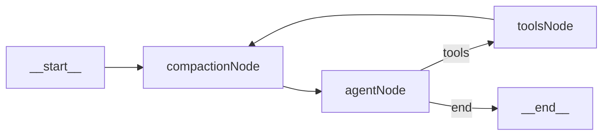

# Plan de implementación: compaction node en el grafo

## Objetivo

Agregar un `compaction_node` al loop del agente para prevenir Context Rot de forma automática, aplicando dos etapas (microcompact y LLM compaction) y manteniendo intactas las responsabilidades actuales de `agent_node`, `toolExecutorNode`, HITL, `iterationCount` derivado y checkpointer.

## Estado actual observado

- El estado del grafo (`GraphState`) está inline en `[packages/agent/src/graph.ts](packages/agent/src/graph.ts)`, no existe aún `[packages/agent/src/state.ts](packages/agent/src/state.ts)`.
- Topología vigente:
  - `__start__ -> agent -> (tools | __end__)`
  - `tools -> agent`
- El historial se acumula con reducer append en `messages`, y el checkpointer persiste por `sessionId`.

## Topología objetivo

## Cambios propuestos

- **Estado del grafo**
  - Crear/extraer `[packages/agent/src/state.ts](packages/agent/src/state.ts)` para centralizar `GraphState`.
  - Agregar `compactionCount: number` con `default: () => 0` (y reducer de reemplazo para evitar acumulación accidental).
  - Importar `GraphState` desde `graph.ts` para mantener contratos tipados consistentes.
- **Nuevo nodo de compactación**
  - Crear `[packages/agent/src/nodes/compaction_node.ts](packages/agent/src/nodes/compaction_node.ts)` con función pura de nodo LangGraph que reciba `state` y retorne `Partial<State>`.
  - Implementar etapa 1 (microcompact, costo 0):
    - Detectar `ToolMessage` antiguos y reemplazar contenido por `"[tool result cleared]"`.
    - Preservar sin limpiar los últimos 5 tool results.
    - Mantener estructura/orden de mensajes (sin alterar semántica de turnos recientes).
  - Implementar etapa 2 (LLM compaction, condicional):
    - Calcular ocupación de ventana y compactar solo cuando supere 80% (no 95%).
    - Invocar modelo “Haiku” para resumir en 9 secciones estructuradas.
    - Sanitizar salida eliminando cualquier bloque `<analysis>...</analysis>` antes de reinyectar.
    - Reinyectar resumen como mensaje de contexto compacto y conservar cola reciente de mensajes para continuidad operativa.
  - Circuit breaker:
    - Llevar contador de fallos consecutivos en `compactionCount`.
    - Si hay 3 fallos seguidos, devolver mensajes sin compactar y resetear flujo al camino normal (evita loops infinitos).
- **Cableado del grafo**
  - En `[packages/agent/src/graph.ts](packages/agent/src/graph.ts)`:
    - Reemplazar `__start__ -> agent` por `__start__ -> compaction`.
    - Agregar `compaction -> agent`.
    - Cambiar `tools -> agent` por `tools -> compaction` (edge crítico).
    - Mantener intacto `shouldContinue` y el guard de `MAX_TOOL_ITERATIONS`.
- **Modelo y configuración para compaction**
  - Extender `[packages/agent/src/model.ts](packages/agent/src/model.ts)` con una factory dedicada para compaction (Haiku), separada de `createChatModel()` para no afectar el modelo principal del agente.
  - Parametrizar ventana máxima y umbral (`0.8`) con constantes en el nodo para control explícito y futura configuración.

## Criterios de aceptación

- Todo resultado de tool pasa por microcompact antes de volver a `agent` (`tools -> compaction -> agent`).
- Microcompact preserva los últimos 5 `ToolMessage` íntegros y limpia los anteriores.
- LLM compaction solo corre por encima de 80% de ventana.
- La salida compactada no contiene bloques `<analysis>`.
- Tras 3 fallos consecutivos de compactación, el nodo hace passthrough sin bloquear el grafo.
- No hay cambios funcionales en HITL, tool execution, checkpointer, ni en la condición de iteraciones.

## Riesgos y mitigación

- Riesgo de estimación imperfecta de ocupación de ventana: usar heurística conservadora (80%) y buffer fijo.
- Riesgo de pérdida de contexto útil en limpieza agresiva: preservar últimos 5 resultados + cola reciente además del resumen estructurado.
- Riesgo de inestabilidad por errores del compactador: circuit breaker + fallback passthrough.

## Validación técnica

- Ejecutar `type-check` en `@agents/agent`.
- Simular conversación con múltiples tool calls y verificar transición de edges esperada.
- Verificar que, al superar umbral, aparece resumen de 9 secciones y no quedan tags `<analysis>`.
- Forzar 3 fallos del compactador (mock/error) y confirmar fallback sin loop.